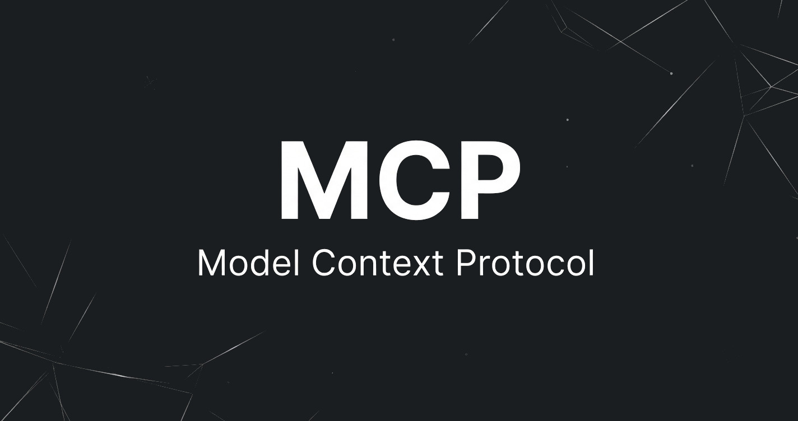
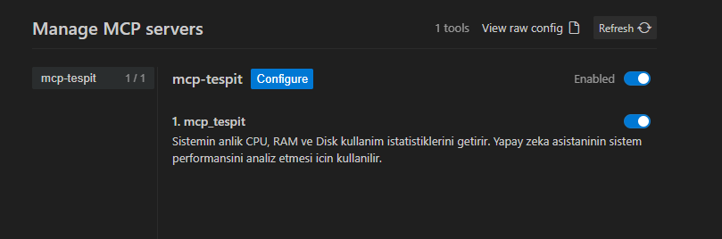

# mcp-tespit

Bu, yapay zeka asistanlarinin (ornegin Claude) bilgisayarinizin anlik CPU, RAM ve Disk kullanimini gorebilmesini saglayan Model Context Protocol (MCP) aracidir.

## Kurulum

Gerekli kutuphaneleri kurun:
   ```bash
   pip install -r requirements.txt
   ```

## Server'ı Ayağa Kaldırma

Sunucuyu iki farklı modda çalıştırabilirsiniz:

**1. Claude Desktop ve MCP İstemcileri İçin (STDIO - Varsayılan)**
Bu modda sunucu arkaplanda doğrudan standart I/O üzerinden iletişim kurar.
```bash
python server.py --transport stdio
```

**2. Web/Ağ Üzerinden Erişmek İçin (SSE)**
Eğer MCP sunucunuza normal bir sunucu gibi ayağa kalkıp bir port (örn: 8000) üzerinden çalışmasını isterseniz:
```bash
python server.py --transport sse --port 8000
```
*(Bu komutu girdiğinizde sunucu 8000 portunda dinlemeye başlar ve log verir.)*

## Claude Desktop'a Ekleme

Claude uygulamasinin ayarlarindaki konfigürasyon dosyasina sunu ekleyin (yolu kendi bilgisayariniza gore duzeltin):

```json
{
  "mcpServers": {
    "sysinfo": {
      "command": "python",
      "args": ["C:/tam/yol/server.py", "--transport", "stdio"]
    }
  }
}
```


**[MCP Blog Yazısını Oku](https://enableroot.com/blog/mcp)**
